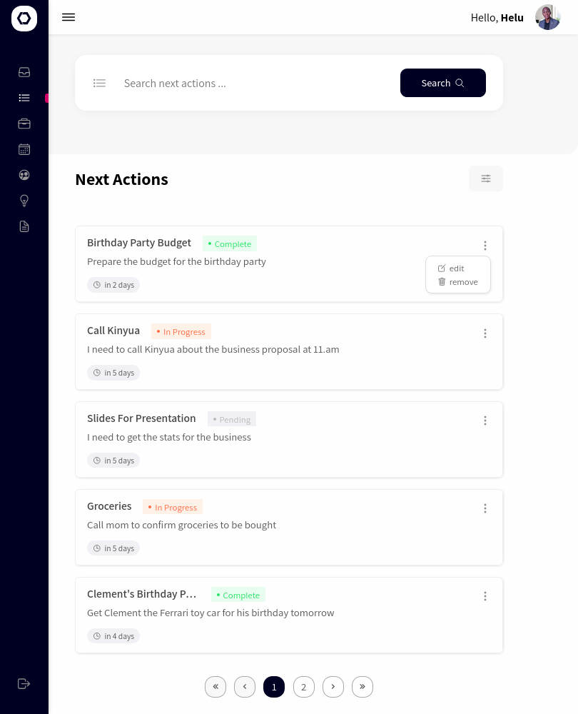

# GTD App
This is a task management app that helps you stay organized and productive by using the GTD methodology. You can use this app to capture ideas and commitments, organize tasks and projects, track progress, schedule appointments, and review and update your tasks and projects. 

## Table of Contents
- [Overview](#overview)
  - [Features](#features)
  - [Screenshot](#screenshot)
  - [Links](#links)
- [My process](#my-process)
  - [Built with](#built-with)
  - [What I learned](#what-i-learned)
  - [Useful resources](#useful-resources)
- [Author](#author)

## Overview

## Features
- Capture ideas and commitments quickly and easily
- Organize tasks and projects by context and priority
- Track progress on tasks and projects
- Schedule appointments and events
- Easily review and update your tasks and projects

## Usage

A user should be able to:

1. Create an account or log in to an existing account
2. Capture any commitments, ideas, or tasks that come to mind using the "inbox" feature.
3. Organize your tasks and commitments by assigning them to next actions,projects,waiting for, someday and references list.
4. Work on your tasks and commitments based on their context and priority
5. Schedule appointments and events using the "Calendar" feature

## Screenshot

## Links

- Live Site URL: [live link](https://borehelu.github.io/order-summary-component/)

## My process

### Built with

Frontend

- Semantic HTML5 markup
- CSS custom properties
- Flexbox, Grid
- Styled-Components
- React dnd
- Mobile-first workflow

Backend
- Nodejs
- Express, Express-validator
- MySQL
- JWT tokens for authentication

### What I learned

I learnt the importance of using preprocessors to speed up the writing of css styles following the DRY philosophy. SASS allowed to use the typical programming constructs in CSS making the entire process very enjoyable. I enjoyed using mixins to encapsulate reusable styles under a name that I could include everywhere the group of styles were needed.

### Useful resources

- [w3schools Sass Tutorial](https://www.w3schools.com/sass/default.php) - This helped me get quickly upto speed with the syntax for SASS.

## Author

- Twitter - [@helu_bore](https://www.twitter.com/helu_bore)

